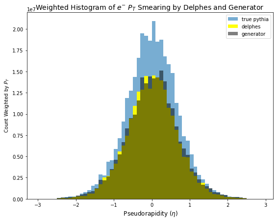
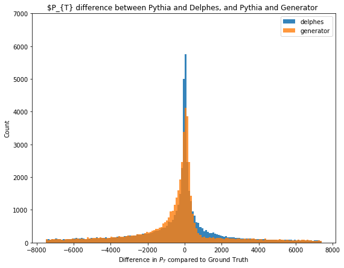
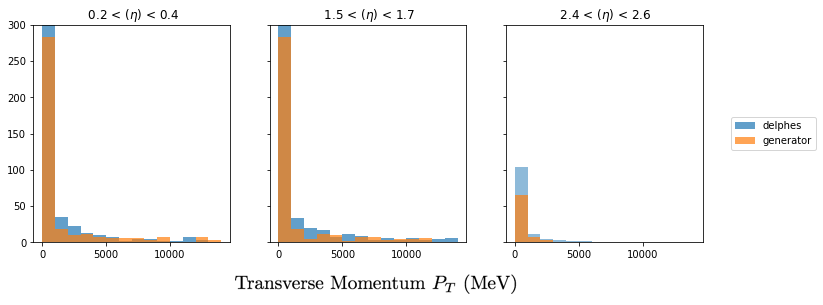

# GANs for HEP detector simulation

Here is a repo for exploring the use of generative adversarial networks for emulating high energy physics detector simulation.

## Example: Simple Momenta Smearing

Firing an electron a variable momenta and angle again and again at a detector. Delphes is told how to inefficiently detect these elctrons. It will have an uncertainty on the true transverse momentum $P_{T}$ which is dependent on some pseudorapidity $\eta$. The smearing increases slightly as $\eta$ increases. $ - 2.5 < \eta < 2.5$








### Prerequisites

If not using the saved numpy data files, you will need Delphes (3.3.3) + ROOT (5.34.36)

```
Give examples
```
