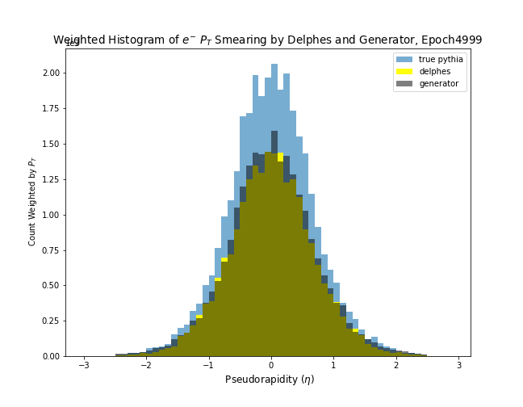

# GANs for HEP detector simulation

Here is a repo for exploring the use of generative adversarial networks for emulating high energy physics detector simulation.

## First example



### Prerequisites

If not using the saved numpy data files, you will need Delphes (3.3.3) + ROOT (5.34.36)

```
Give examples
```
